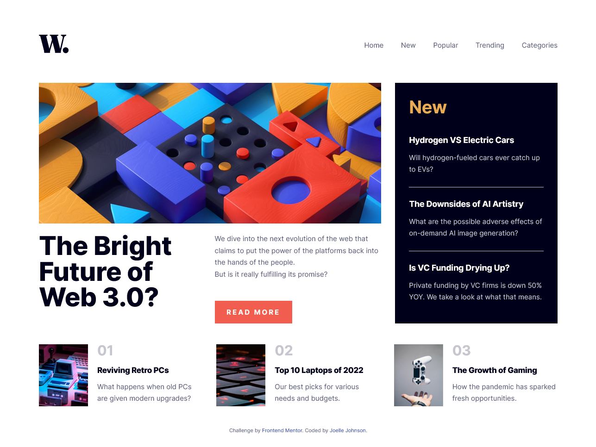

# Frontend Mentor - News homepage solution

This is a solution to the [News homepage challenge on Frontend Mentor](https://www.frontendmentor.io/challenges/news-homepage-H6SWTa1MFl). Frontend Mentor challenges help you improve your coding skills by building realistic projects. 

## Table of contents

- [Overview](#overview)
  - [The challenge](#the-challenge)
  - [Screenshot](#screenshot)
  - [Links](#links)
- [My process](#my-process)
  - [Built with](#built-with)
  - [What I learned](#what-i-learned)
  - [Continued development](#continued-development)
- [Author](#author)

## Overview

### The challenge

Users should be able to:

- View the optimal layout for the interface depending on their device's screen size
- See hover and focus states for all interactive elements on the page

### Screenshot

### Links

- Solution URL: [Solution Code](https://github.com/johnsonjoelle/FEM-news-homepage-main)
- Live Site URL: [Github Pages Live Site](https://johnsonjoelle.github.io/FEM-news-homepage-main/)

## My process

### Built with

- Semantic HTML5 markup
- CSS custom properties
- Flexbox
- CSS Grid
- Destop-first workflow
- Media Queries
- JavaScript event listeners

### What I learned

While working on this project I attempted to make use of the img element's srcset attribute for the first time. I initially used it on the hero image for the headline article. While this is a viable option for creating responsive images, the downside is that the image does not change with the viewport. The page will load whichever image fits the size criteria when the DOM is loaded, if the viewport is resized the image will not change until the page is refreshed. Due to this limitation I instead used classes to change which image is visible.

### Continued development

In future projects I'd like to explore the use of container queries in lieu of (or alongside) media queries. I believe container queries could have been used in this project, however they are not yet fully compatible with Firefox, which is the browser I primarily work in.

## Author

- Website - [Joelle Johnson](https://joellejohnson.com)
- Frontend Mentor - [@johnsonjoelle](https://www.frontendmentor.io/profile/johnsonjoelle)

